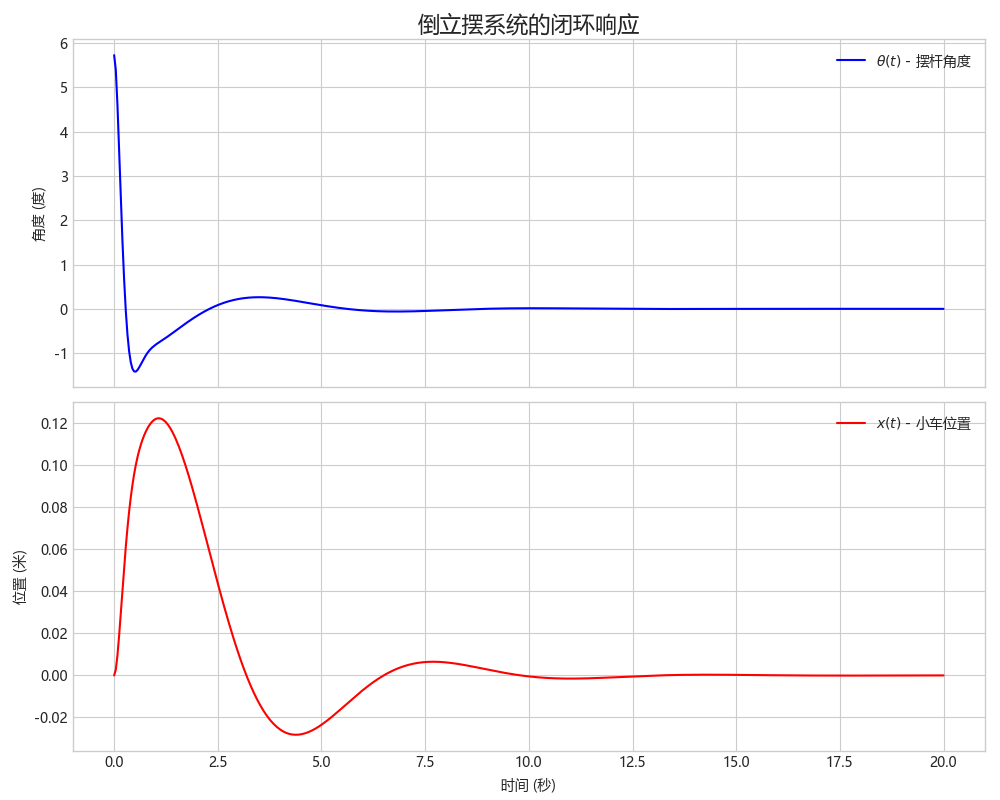

考虑如下倒立摆模型：

$$
\dot{x}\left( t \right) =Ax\left( t \right) +Bu\left( t \right)
$$

其中，

$$
A=\left[ \begin{matrix}
	0&		1&		0&		0\\
	0&		0&		-\frac{m^2gl^2}{\Delta}&		0\\
	0&		0&		0&		1\\
	0&		0&		\frac{mgl\left( M+m \right)}{\Delta}&		0\\
\end{matrix} \right]
$$

$$
B=\left[ \begin{array}{c}
	0\\
	\frac{I+ml^2}{\Delta}\\
	0\\
	-\frac{ml}{\Delta}\\
\end{array} \right]
$$

$$
\Delta =I\left( M+m \right) +Mml^2
$$

假设参数列表如下：

$$
M=1.0kg,m=0.1kg,L=0.5m,g=9.8m/s^2
$$

代入计算得到：

$$
A=\left[ \begin{matrix}
	0&		1&		0&		0\\
	0&		0&		-0.7171&		0\\
	0&		0&		0&		1\\
	0&		0&		31.5512&		0\\
\end{matrix} \right] ,B=\left[ \begin{array}{c}
	0\\
	0.9756\\
	0\\
	-2.9268\\
\end{array} \right]
$$

设计控制器：

$$
u\left( t \right) =-Kx\left( t \right)
$$

所以：

$$
\dot{x}\left( t \right) =\left( A-BK \right) \cdot x\left( t \right)
$$

系统的稳定性问题可以通过寻找一个正定对称矩阵$P$来判断，该矩阵需满足李雅普诺夫不等式：
$$(A+BK)^TP+P(A+BK)<0$$
先不考虑正反馈还是负反馈。
上式中包含耦合项，我们可以令 $Q = P^{-1}$ 和 $Y = KQ$，可以将其转化为一个标准的 LMI 问题： \*寻找变量 $Q > 0$ 和 $Y$，使得下式成立：
$$AQ + BY + (AQ + BY)^T < 0$$
如果这个 LMI 问题有解，那么就存在一个稳定的控制器$K$。

利用 MATLAB 的 YALMIP 工具箱`sol1.m`求解得出：

$$
K=\left[ 2.7021\ 2.6267\ 39.6988\ 5.1432 \right]
$$

设定初始状态为`x0 = [0, 0, 0.1, 0]`，仿真`simulate_pendulum.py`得到：

