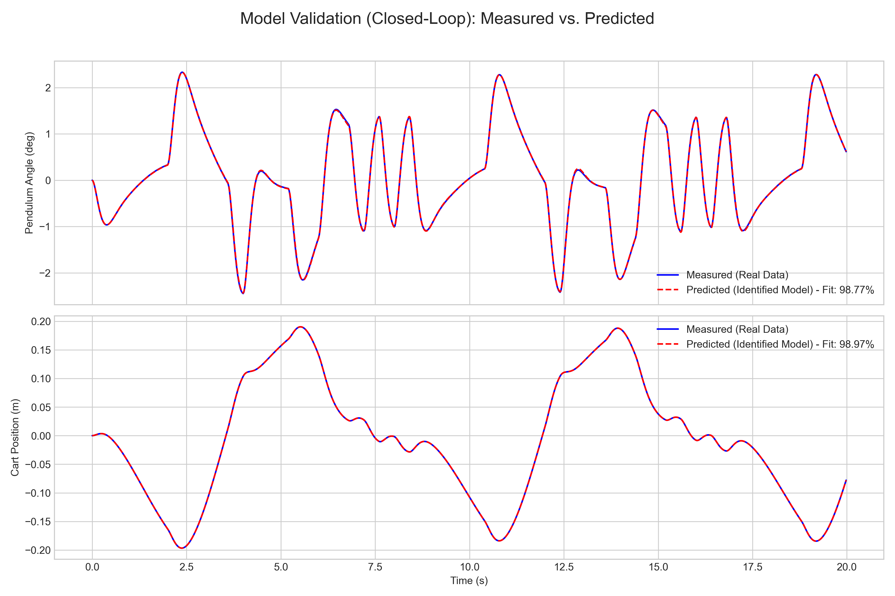
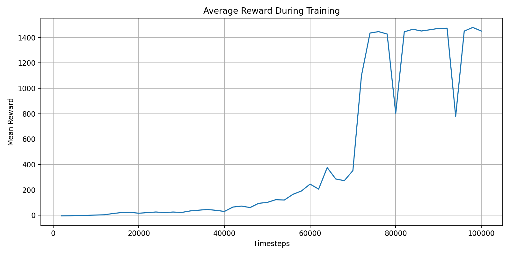

# Cart-Pole System

倒立摆（Cart-Pole）实验与对比：把同一控制对象放在三条路线下做“可复现实现 + 可视化结果”的对照。

推荐入口：
- 研究路线总览：`Cart-Pole System/工作.md`
- Lab1（建模/线性化 + LQR）：`Cart-Pole System/Lab1/倒立摆模型.md`
- Lab2（系统辨识 + LQR）：`Cart-Pole System/Lab2/`
- Lab3（强化学习控制，PPO）：`Cart-Pole System/Lab3/`

## 结果截图（部分）

